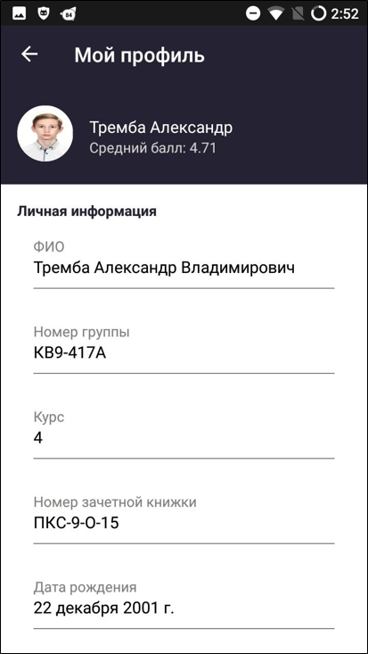
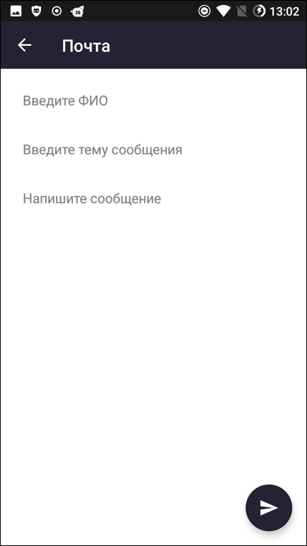

# Alexandria

Студенческий проект
Alexandria - приложение сделанное на основе API запросов к сайту stud.sssu.ru 
Отображает всю полезную информацию с главного сайта. Позволяет загружать домашнее задание на сайт.
Скачать приложение можно во вкладке RELEASE

### В дальнейшем требуется добавить следующий функционал:
+ Лента новостей и Зачетная книжка должны обзавестись фильтром
+ В Ленту новостей добавить если у пользователя есть непрочитанные сообщения и переход по нажатию на элемент 
+ Добавить фрагмент для входа в приложение
+ Добавить авто-обновление
+ Перейти на KMM

Связь: @dev_null_exception

## Скрины приложения

